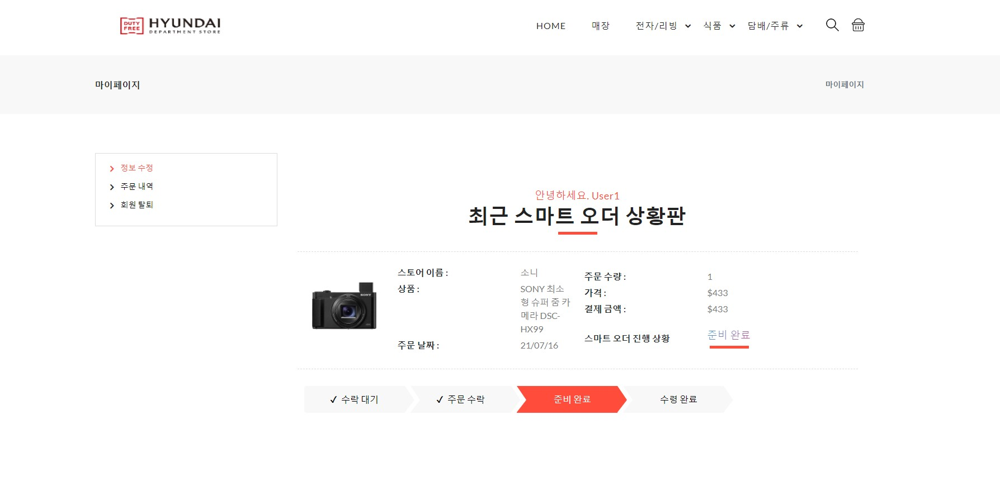

## 프로젝트

> 프로젝트 명 : traffic bye
>
> 팀원 : 김태형, 김남수, 반어진, 허준수
>
> 프로젝트 상세
>
> - 면세점의 매장 혼잡도를 분석하고 결제할 수 있는 서비스 개발
> - Spring / Oracle Cloud / AWS S3 기반 웹앱 서비스
> - Spring REST API 백엔드 구성
>
> - Spring, Mybatis, Ajax, JQuery, 오라클 클라우드, AWS S3, 스프링 시큐리티, OAuth , 라즈베리파이 기술 적용
>
> - Jira/컨플루언스/비트버킷을 사용해 협업 및 이슈 관리

## 프로젝트 개요

> **프로젝트 소개**
>
> ㅇ 면세점에서 긴 대기열로 인한 소비자들의 불편 발생
>
> ㅇ 스마트 오더와 혼잡도 분석으로 불편사항 해소를 목표로 함
>
> ㅇ 이를 통해 사용자는 출국 시간 전에 시간을 효율적으로 사용하며 쇼핑할 수 있음

> **프로젝트 상세** 
>
> \-    면세점의 매장 혼잡도를 분석하고 결제할 수 있는 서비스 개발
>
> \-    Spring / Oracle Cloud / AWS S3  기반 웹 서비스
>
> \-    Spring REST API 백엔드 구성
>
> \-    Spring, Mybatis, Ajax, JQuery, 오라클 클라우드, AWS S3, 스프링 시큐리티, OAuth , 라즈베리파이 기술 적용

> **서비스 동작구조**
>
> 

## 핵심기능 및 기대효과

> **핵심기능**
>
> - 스프링 시큐리티 적용으로 인한 보안성 강화
> - 결제 및 스마트 오더 알림 시스템
> - 라즈베리 파이를 이용한 실시간 혼잡도 분석 및 영상 송출

> **기대효과**
>
> - 매장의 혼잡도를 미리 파악할 수 있기 때문에 소비자들이 효율적으로 시간을 활용
> - 소비자들의 시간 절약으로 인한 만족감 상승
> - 절약된 시간을 통한 다른 상품 구매를 유도해 매출 증대
> - 해당 프로세스를 면세점 이외의 상점에 확대 적용 가능성 

> **본인 인증(카카오)**

> **본인 인증(휴대폰)**

.JPG)

> **S3 파일서버**

> **결제 : 아임포트 API**

> **스마트 오더**

> **혼잡도 분석**

> **영상 송출**

> **객체 검출**

> **검출 결과**

# 페이지 소개

#### 메인 페이지

#### 상품 목록 페이지

#### 상품 상세 페이지

#### 장바구니 등록

#### 스마트 오더 주문하기

> **결제(고객)**

.JPG)

> **관리자**

.JPG)

#### 매장 페이지

> **매장 소개**

> **매장안내 페이지**

> **매장 혼잡도 분석**

#### 관리자 페이지

> **관리자 메인 페이지**

> **상품 목록 조회**

> **상품 등록**

> **매장관리**

